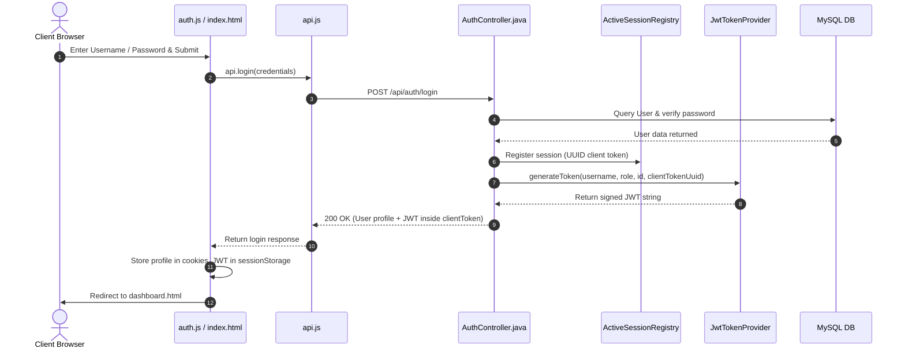
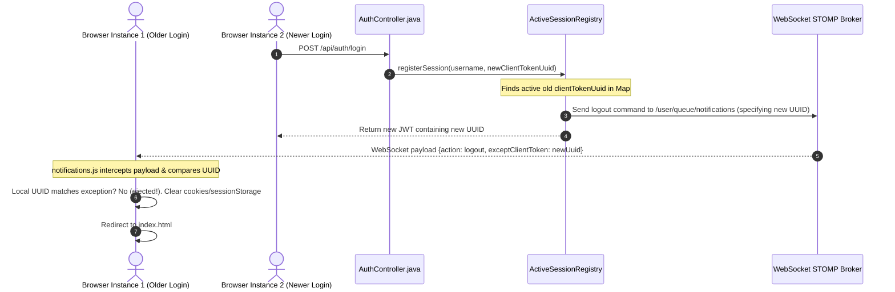
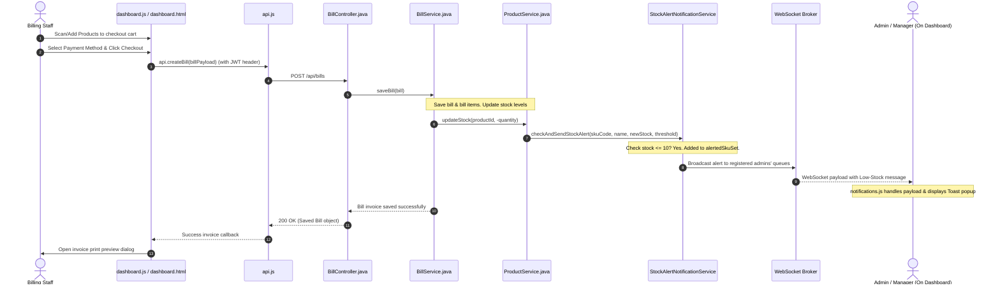
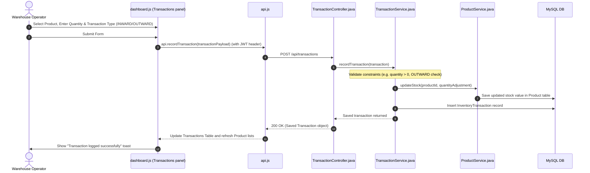

# GMart Project Architecture and File-by-File Flow

Welcome to the **GMart Full Stack** project flow documentation. This file provides an exhaustive, file-by-file breakdown of the system, illustrating how the standalone **Java Spring Boot backend** interacts with the **decoupled vanilla HTML5/CSS3/JS frontend**.

---

## 🏗️ Architectural Overview
GMart is structured as a decoupled full-stack application:
1. **Frontend (Client-Side)**: A Progressive Web App (PWA) utilizing vanilla web technologies. It communicates with the backend via a REST API (using the browser `fetch` API) carrying stateless JWT tokens, and receives real-time events over WebSockets (STOMP protocol layered on SockJS, authenticated via STOMP headers). Includes skeleton loaders during resource loads.
2. **Backend (Server-Side)**: A Java Spring Boot application following the standard **N-Tier design pattern**:
   * **Controllers (Web/REST Layer)**: Receives HTTP requests, maps JSON payloads, handles routes, and returns JSON responses (including generating JWT login payloads).
   * **Services (Business Logic Layer)**: Implements core rules, calculations, stock adjustments, database queries, and notifications.
   * **Repositories (Data Access Layer)**: Interfaces extending `JpaRepository` to perform CRUD operations on the MySQL database.
   * **Security/Config Layer**: Manages CORS, stateless JWT authentication filters, token validation utilities, STOMP channel interceptors, and WebSocket configs.

---

## 📂 Project Directory Structure

```
Gmart_Full_Stack/
├── backend/                             # Java Spring Boot Backend Service
│   ├── pom.xml                          # Maven configurations & dependency setup (inc. JJWT)
│   ├── src/main/java/com/gokulrajvel/gmart/
│   │   ├── GmartApplication.java        # Spring Boot Entry Point
│   │   ├── config/                      # Web Security, JWT Filter, WebSocket & Seed configurations
│   │   ├── controller/                  # REST Controllers exposing APIs
│   │   ├── data/                        # Enums and Entities (DTOs)
│   │   ├── repository/                  # JPA repositories for Database Access
│   │   └── service/                     # Business Logic Services
│   └── src/main/resources/
│       └── application.properties       # Database settings and Server configurations
├── frontend/                            # Decoupled Web Frontend
│   ├── index.html                       # Login Screen (PWA entry point with Service Worker registration)
│   ├── dashboard.html                   # Dashboard SPA Console (PWA console with Service Worker registration)
│   ├── css/
│   │   └── style.css                    # Unified Design System Stylesheet & Skeleton loader frames
│   ├── public/                          # Static assets copied by Vite to build root
│   │   ├── icon.png                     # PWA logo icon (512x512)
│   │   ├── manifest.json                # Web App Manifest describing configuration
│   │   └── sw.js                        # Service Worker (offline caching policy)
│   └── js/
│       ├── api.js                       # HTTP Request Client / JWT Transport layer
│       ├── auth.js                      # Authentication & Theme Manager
│       ├── dashboard.js                 # Dashboard Controllers, View Handler & Skeleton helper
│       └── notifications.js             # WebSocket STOMP Client (JWT Authenticated)
└── PROJECT_FLOW.md                      # Architecture & File flow reference (this file)
```

---

## 🧱 Backend: File-by-File Breakdown

### 1. Application Entry Point
* **`GmartApplication.java`**
  * **Role**: Bootstraps the Spring Boot application using `@SpringBootApplication`.
  * **Details**: Initializes the servlet container, registers beans, and loads environment variables.

### 2. Configuration & Infrastructure (`config/`)
* **[SecurityConfig.java](file:///home/pain/IdeaProjects/Gmart_Full_Stack/backend/src/main/java/com/gokulrajvel/gmart/config/SecurityConfig.java)**
  * **Role**: Configures stateless security filters, CORS, path authorization, and token revocation.
  * **Key Details**: 
    * Sets up stateless session management (`SessionCreationPolicy.STATELESS`), disabling HTTP sessions.
    * Registers the custom `JwtAuthenticationFilter` to intercept requests.
    * Permits public access to UI routes, login, and `/ws/**` handshake endpoints (WebSocket STOMP layer authenticates individually).
    * Implements a custom `PasswordEncoder` default to BCrypt with legacy plain-text fallback.
    * Installs a custom logout handler to clean the active session registry when the logout endpoint is hit.
* **[JwtTokenProvider.java](file:///home/pain/IdeaProjects/Gmart_Full_Stack/backend/src/main/java/com/gokulrajvel/gmart/config/JwtTokenProvider.java)**
  * **Role**: Encapsulates cryptographic signing and validation of JWTs.
  * **Key Details**: Utilizes standard HS256 to package the user's username, role, database ID, and concurrent session identifier UUID inside the JWT payload claims.
* **[JwtAuthenticationFilter.java](file:///home/pain/IdeaProjects/Gmart_Full_Stack/backend/src/main/java/com/gokulrajvel/gmart/config/JwtAuthenticationFilter.java)**
  * **Role**: Intercepts HTTP requests to extract and validate Bearer tokens.
  * **Key Details**: Checks the `Authorization: Bearer <token>` header, decodes user credentials, validates current session concurrency status with `ActiveSessionRegistry`, and binds authentication details to Spring's SecurityContext.
* **[WebSocketConfig.java](file:///home/pain/IdeaProjects/Gmart_Full_Stack/backend/src/main/java/com/gokulrajvel/gmart/config/WebSocketConfig.java)**
  * **Role**: Registers STOMP endpoints and enforces JWT authentication on inbound STOMP channels.
  * **Key Details**: 
    * Maps `/ws` SockJS endpoint.
    * Binds a client inbound channel interceptor to parse the `Authorization` header during a STOMP `CONNECT` frame, verifying connection credentials against `JwtTokenProvider` before allowing subscriptions.
* **[ActiveSessionRegistry.java](file:///home/pain/IdeaProjects/Gmart_Full_Stack/backend/src/main/java/com/gokulrajvel/gmart/config/ActiveSessionRegistry.java)**
  * **Role**: Manages active user session tokens in Redis.
  * **Key Details**: Tracks `gmart:session:<username> -> clientTokenUuid` mappings in Redis. If a user logs in on a different browser, it triggers a WebSocket broadcast (`action: logout`) over `/queue/notifications` to eject the older browser instance, ensuring single concurrent session enforcement.
* **[SessionListener.java](file:///home/pain/IdeaProjects/Gmart_Full_Stack/backend/src/main/java/com/gokulrajvel/gmart/config/SessionListener.java)**
  * **Role**: Disabled. Lifecycle tracking is no longer used since sessions are stateless.
* **[DatabaseSeeder.java](file:///home/pain/IdeaProjects/Gmart_Full_Stack/backend/src/main/java/com/gokulrajvel/gmart/config/DatabaseSeeder.java)**
  * **Role**: Bootstraps the application data (`CommandLineRunner`).
  * **Key Details**: Seeds a default administrator account (`Gokulraj` / `Gokulraj@2`) if the user repository is empty and migrates unhashed credentials.

### 3. Domain Entities & Enums (`data/`)
* **`User.java`**: Maps to database table `users`. Fields: `id`, `username`, `password`, `role`.
* **`Product.java`**: Maps to database table `products`. Fields: `id`, `skuCode`, `name`, `categoryId`, `supplierId`, `price`, `stockQuantity`, `discount`, `gst`.
* **`Supplier.java`**: Maps to database table `suppliers`. Fields: `id`, `name`, `contactInfo`.
* **`InventoryTransaction.java`**: Maps to database table `transactions`. Holds audit logs for stock changes. Fields: `id`, `productId`, `userId`, `transactionType` (`INWARD` or `OUTWARD`), `quantity`, `transactionDate`, `notes`.
* **`Bill.java`**: Maps to database table `bills`. Represents a customer purchase invoice. Fields: `id`, `userId`, `totalAmount`, `taxAmount`, `paymentMethod`, `billDate`, `items` (`OneToMany` mapping to `BillItem`).
* **`BillItem.java`**: Maps to database table `bill_items`. Represents individual line items in a bill. Fields: `id`, `productId`, `productName`, `quantity`, `priceAtSale`.
* **`Role.java`**: Enum defining permissions: `ADMIN`, `BILLING_STAFF`, `WAREHOUSE`, `PURCHASING_MANAGER`.
* **`Category.java`**: Enum representing product classifications.
* **`PaymentMethod.java`**: Enum for customer checkouts: `CASH`, `CARD`, `UPI`.

### 4. Data Access Layer (`repository/`)
* Standard Spring Data JPA repositories interfacing with Hibernate/MySQL.
  * **`UserRepository.java`**: Includes custom query `findByUsername`.
  * **`ProductRepository.java`**: Includes custom query `findBySkuCode`.
  * **`SupplierRepository.java`**
  * **`BillRepository.java`**
  * **`TransactionRepository.java`**

### 5. Service (Business Logic) Layer (`service/`)
* **[UserService.java](file:///home/pain/IdeaProjects/Gmart_Full_Stack/backend/src/main/java/com/gokulrajvel/gmart/service/UserService.java)**: Implements user authentication logic and standard CRUD.
* **[CustomUserDetailsService.java](file:///home/pain/IdeaProjects/Gmart_Full_Stack/backend/src/main/java/com/gokulrajvel/gmart/service/CustomUserDetailsService.java)**: Core Spring Security service loading user data during authorization requests.
* **[ProductService.java](file:///home/pain/IdeaProjects/Gmart_Full_Stack/backend/src/main/java/com/gokulrajvel/gmart/service/ProductService.java)**: Implements product management, inventory updates, and triggers low-stock checks.
* **[SupplierService.java](file:///home/pain/IdeaProjects/Gmart_Full_Stack/backend/src/main/java/com/gokulrajvel/gmart/service/SupplierService.java)**: Manages supplier directory logic.
* **[TransactionService.java](file:///home/pain/IdeaProjects/Gmart_Full_Stack/backend/src/main/java/com/gokulrajvel/gmart/service/TransactionService.java)**: Handles inward and outward inventory adjustments. Adjusts product stock levels via `ProductService` and records audit entries.
* **[BillService.java](file:///home/pain/IdeaProjects/Gmart_Full_Stack/backend/src/main/java/com/gokulrajvel/gmart/service/BillService.java)**: Persists customer checkout invoices.
* **[StockAlertNotificationService.java](file:///home/pain/IdeaProjects/Gmart_Full_Stack/backend/src/main/java/com/gokulrajvel/gmart/service/StockAlertNotificationService.java)**:
  * Performs stock quantity checks.
  * If a product's stock is at or below the minimum threshold (e.g. 10), it broadcasts a real-time notification via WebSocket to all active `ADMIN` and `PURCHASING_MANAGER` users.
  * Tracks notified products in a thread-safe Set to prevent duplicate notifications until stock levels are replenished.

### 6. Controller (REST API) Layer (`controller/`)
* **[AuthController.java](file:///home/pain/IdeaProjects/Gmart_Full_Stack/backend/src/main/java/com/gokulrajvel/gmart/controller/AuthController.java)**:
  * Exposes `/api/auth/login` (POST) to authenticate user credentials, register session UUIDs, generate signed JWTs, and return user profile details.
  * Exposes `/api/auth/status` (GET) to allow UI clients to verify token status.
* **[UserController.java](file:///home/pain/IdeaProjects/Gmart_Full_Stack/backend/src/main/java/com/gokulrajvel/gmart/controller/UserController.java)**: Exposes endpoints to search, add, edit, and delete user profiles.
* **[ProductController.java](file:///home/pain/IdeaProjects/Gmart_Full_Stack/backend/src/main/java/com/gokulrajvel/gmart/controller/ProductController.java)**: Exposes CRUD endpoints for products.
* **[SupplierController.java](file:///home/pain/IdeaProjects/Gmart_Full_Stack/backend/src/main/java/com/gokulrajvel/gmart/controller/SupplierController.java)**: Exposes endpoints for managing suppliers.
* **[TransactionController.java](file:///home/pain/IdeaProjects/Gmart_Full_Stack/backend/src/main/java/com/gokulrajvel/gmart/controller/TransactionController.java)**: Exposes endpoints to retrieve inventory transaction logs and record new ones.
* **[BillController.java](file:///home/pain/IdeaProjects/Gmart_Full_Stack/backend/src/main/java/com/gokulrajvel/gmart/controller/BillController.java)**: Exposes endpoints to fetch billing histories and process new invoices.

---

## 🎨 Frontend: File-by-File Breakdown

### 1. Presentation Templates (HTML)
* **[index.html](file:///home/pain/IdeaProjects/Gmart_Full_Stack/frontend/index.html)**
  * **Role**: The login portal.
  * **Key Details**: Features theme initialization, registers the Service Worker for installation, and links `manifest.json`.
* **[dashboard.html](file:///home/pain/IdeaProjects/Gmart_Full_Stack/frontend/dashboard.html)**
  * **Role**: The Single Page Application (SPA) dashboard console.
  * **Key Details**: Registers the Service Worker, sets up all structural sections (Inventory, Users, Billing, etc.), and implements dynamic CSS view toggles.

### 2. PWA Static Assets (`public/`)
* **[manifest.json](file:///home/pain/IdeaProjects/Gmart_Full_Stack/frontend/public/manifest.json)**
  * **Role**: Defines metadata for installing GMart as a Progressive Web App on desktops or mobile home screens.
* **[sw.js](file:///home/pain/IdeaProjects/Gmart_Full_Stack/frontend/public/sw.js)**
  * **Role**: Client service worker handling caching structures.
  * **Key Details**: Implements an installer caching shell (`PRE_CACHE`) and a stale-while-revalidate fetching cache for static assets. Ignores dynamic `/api/**` and `/ws/**` backend calls.

### 3. Styling (CSS)
* **[style.css](file:///home/pain/IdeaProjects/Gmart_Full_Stack/frontend/css/style.css)**
  * **Role**: Centralized UI styling.
  * **Key Details**: Houses global color tokens, dark/light visual parameters, custom CSS shimmer variables (`@keyframes skeleton-shimmer`), and class definitions for active skeletons.

### 4. JavaScript Logic Layer (`js/`)
* **[api.js](file:///home/pain/IdeaProjects/Gmart_Full_Stack/frontend/js/api.js)**
  * **Role**: Universal API Client utility.
  * **Key Details**: 
    * Wraps `fetch` requests and automatically appends the `Authorization: Bearer <token>` header if a JWT exists.
    * Intercepts `401 Unauthorized` responses to clear invalid tokens and redirect to `index.html`.
    * Exposes API endpoint maps (including `/auth/logout`).
* **[auth.js](file:///home/pain/IdeaProjects/Gmart_Full_Stack/frontend/js/auth.js)**
  * **Role**: Authentication and theme manager.
  * **Key Details**: Validates form entries, saves safe credentials inside cookies, and stores the JWT token inside `sessionStorage` under `clientToken`.
* **[dashboard.js](file:///home/pain/IdeaProjects/Gmart_Full_Stack/frontend/js/dashboard.js)**
  * **Role**: SPA controller.
  * **Key Details**: 
    * Handles navigation menus, page adjustments, and registers click events.
    * Features `showTableSkeleton()` and `showStatsSkeleton()` which temporarily swap raw values out for shimmer loaders while await actions load.
    * Implements checkout cart, billing calculations, and requests the backend logout handler upon trigger.
* **[notifications.js](file:///home/pain/IdeaProjects/Gmart_Full_Stack/frontend/js/notifications.js)**
  * **Role**: Real-time STOMP listener.
  * **Key Details**: Establishes websocket socket handshakes over `/ws` and transmits the JWT Bearer token inside the STOMP header connect frame to authorize listener channels.

---

## 🔄 Core Workflows & Dynamic Control Flows

### Workflow 1: Authentication and Session Establishment (Stateless JWT)



---

### Workflow 2: Concurrent Session Eviction (Single Login Enforcement)



---

### Workflow 3: Customer Checkout & Low-Stock Alerts



---

### Workflow 4: Inward/Outward Inventory Transactions



---
*Created automatically for the project: GMart Full Stack.*
